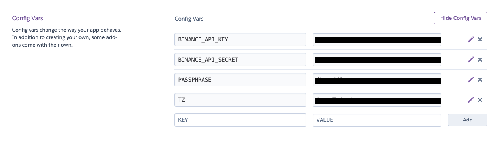
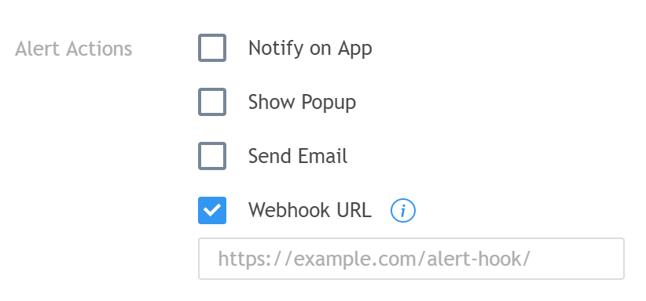

# Tradingview-go


Tradingview-go is a crypto-trading bot triggered by tradingview webhook, and invoke api on heroku.
Currently support binance order and futures.

## Requirement

1. A `Pro` member of [Tradingview](https://www.tradingview.com/) (in order to send webhook)
2. A [Heroku](https://heroku.com) account

## Local Usage

```bash
git clone https://github.com/nathan-tw/tradingview-go.git
cd tradingview-go
docker build -t tradingview-go .
docker run -p 8080:8080 --env BINANCE_API_KEY=$YOUR_API_KEY --env BINANCE_API_SECRET=$YOUR_API_SECRET -e PASSPHRASE=$PASSPHRASE -it tradingview-go
```

## Heroku Usage

### Clone this project

```bash
git clone https://github.com/nathan-tw/tradingview-go.git
cd tradingview-go
rm -rf .git
```

### New a heroku project

```bash
heroku create your_app
```

### Add environment variables for binance api and a self-defined passphrase.

Add environment variables in `Setting -> Config Variables`.



### Edit `passphrase` in `payloads/tradingview_webhook_payload_format.txt`

```json
{
    "passphrase": "Your_PassPhrase_self_defined", 
    "time": "{{timenow}}",
    "exchange": "{{exchange}}",
    "ticker": "{{ticker}}"
}
```

### Deploy this project to heroku

```bash
git init
git add .
git commit -m "initial commit"
heroku git:remote your_app
git push heroku master
```

### New an alert.

After pasting your webhook url, paste the contents of `tradingview_webhook_payload_format.txt` to the message block.



filled the `webhook block` with

 * `Your_Domain/binance_futures_webhook` for futures trading strategy
 * `Your_Domain/binance_webhook` for spot trading strategy

 Copy and paste the contents of `tradingview_webhook_payload_format.txt` to message block

 ### Good Luck

 You're good to go now!
